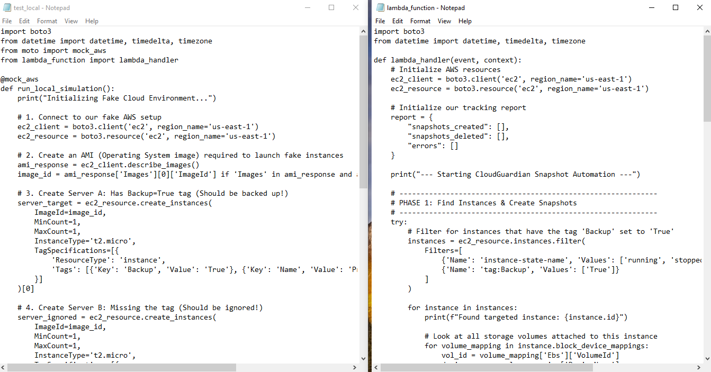
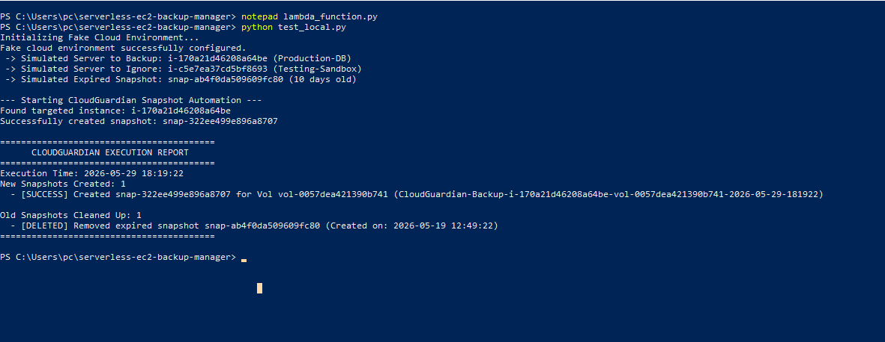

# CloudGuardian – Serverless EC2 Snapshot Backup & Lifecycle Manager

CloudGuardian is a serverless AWS automation project that manages Amazon EBS snapshots for EC2 instances using AWS Lambda and Python boto3.

The system automatically:

* Identifies EC2 instances tagged with `Backup=True`
* Creates EBS snapshots for attached volumes
* Deletes snapshots older than 7 days
* Generates execution logs and an HTML backup report

The project was developed and tested locally using `moto` to simulate AWS services without creating real cloud resources.

---

## AWS Services & Technologies Used

* AWS Lambda
* Amazon EC2
* Amazon EBS Snapshots
* AWS IAM
* Python 3.x
* boto3
* Moto (AWS Mocking Library)
* HTML5 & CSS3
* PowerShell

---

## Key Features

### Automated Snapshot Management

Creates EBS snapshots for tagged EC2 instances automatically.

### Snapshot Retention Policy

Deletes snapshots older than 7 days to reduce unnecessary storage costs.

### Tag-Based Targeting

Processes only EC2 instances with:

```text
Backup=True
```

### Local AWS Infrastructure Simulation

Uses Moto to simulate AWS resources locally for safe testing without AWS charges.

### HTML Execution Report

Generates a detailed HTML dashboard after each execution showing:

* Snapshots created
* Snapshots deleted
* Retention cleanup actions
* Execution summary

---

## Project Architecture

<a href="screenshots/local-mock-architecture.png">
  
</a>

---

## Execution Flow

<a href="screenshots/cloudguardian-execution-flow.png">
  
</a>

---

## Project Structure

```text
serverless-ec2-backup-manager/
│
├── screenshots/
│   ├── cloudguardian-execution-flow.png
│   └── local-mock-architecture.png
│
├── lambda_function.py
├── test_local.py
├── cloudguardian_report.html
└── README.md
```

---

## Local Setup & Testing

### Install Dependencies

```powershell
pip install boto3 moto
```

### Run Local Simulation

```powershell
python test_local.py
```

The simulation script:

* Creates mock EC2 instances
* Adds tagged and untagged servers
* Creates old snapshots
* Executes the Lambda backup lifecycle process
* Generates execution logs and HTML reports

---

## Sample Workflow

1. Scan EC2 instances
2. Filter instances using `Backup=True`
3. Create EBS snapshots
4. Identify snapshots older than 7 days
5. Delete expired snapshots
6. Generate execution report

---

## IAM Permissions Required

The Lambda execution role requires:

```json
ec2:DescribeInstances
ec2:DescribeVolumes
ec2:CreateSnapshot
ec2:DescribeSnapshots
ec2:DeleteSnapshot
logs:CreateLogGroup
logs:CreateLogStream
logs:PutLogEvents
```

---

## Technical Highlights

* Serverless AWS automation
* Infrastructure lifecycle management
* Cost optimization through automated cleanup
* Local cloud simulation using Moto
* Python-based AWS automation with boto3
* IAM least-privilege security design

---

## Future Improvements

* Add EventBridge scheduled triggers
* Add SNS or SES email notifications
* Add Terraform deployment
* Multi-region snapshot replication
* CloudWatch monitoring dashboard
* Cross-account backup support

---

## Author

Varsha Wananje

GitHub:
https://github.com/varsha-cloud9
